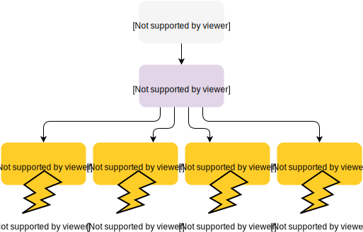

What?
-----
Take 1 TCP listen socket and duplicate it across N threads so you get some sweet multi-thread action happening.

Example usage
-------------
Checkout the speed up for PearDB:

*Before*

.. code-block:: bash

    bench λ wrk -d 10 -c 24 -t 24 --latency -s readonly-pipelining.lua http://127.0.0.1:8888                                                                                                       ~/d/p/bench2
    Running 10s test @ http://127.0.0.1:8888
      24 threads and 24 connections
      Thread Stats   Avg      Stdev     Max   +/- Stdev
        Latency     2.41ms  811.15us   8.62ms   86.40%
        Req/Sec     7.14k     1.52k   10.44k    68.91%
      Latency Distribution
         50%    2.09ms
         75%    2.40ms
         90%    3.95ms
         99%    5.33ms
      1633294 requests in 9.97s, 205.30MB read
      Non-2xx or 3xx responses: 1469582
    Requests/sec: 163850.16
    Transfer/sec:     20.60MB

*After*

.. code-block:: bash

    bench [master] λ wrk -d 10 -c 24 -t 24 --latency -s readonly-pipelining.lua http://127.0.0.1:8888                                                                                              ~/d/p/bench2
    Running 10s test @ http://127.0.0.1:8888
      24 threads and 24 connections
      Thread Stats   Avg      Stdev     Max   +/- Stdev
        Latency     1.54ms    2.49ms  48.06ms   95.51%
        Req/Sec    14.52k     8.54k   51.78k    68.47%
      Latency Distribution
         50%    1.06ms
         75%    1.78ms
         90%    2.94ms
         99%    7.90ms
      3272402 requests in 9.96s, 411.25MB read
      Non-2xx or 3xx responses: 2945770
    Requests/sec: 328413.92
    Transfer/sec:     41.27MB

http://github.com/willemt/peardb/
